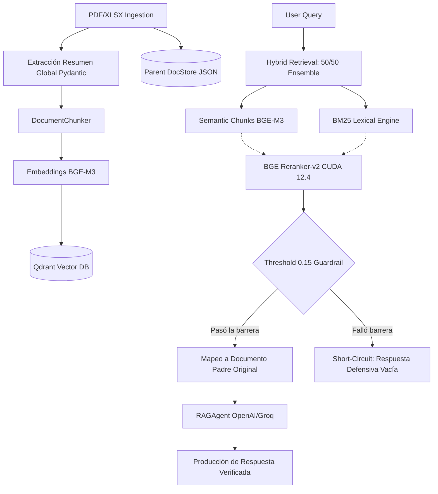

# 🏛️ Arquitectura Enterprise MLOps (RAG Avanzado)

Nuestra tubería RAG (Retrieval-Augmented Generation) se construyó sobre las prácticas comprobadas para reducir alucinaciones empíricas y elevar el techo del "Faithfulness" de las respuestas de IA Generativa.

## 🌊 Diagrama de Flujo del Pipeline (Data to Generation)

## 🧩 Estrategia de Retrieval: Patrón Parent-Child
En lugar de cargar pesados documentos enteros o diminutos trozos de texto inconexos al LLM, hemos partido la tubería empleando heurística *Parent / Child*:

- **Los Hijos (Child Chunks):** Son fragmentos de 400 a 600 tokens con fuerte densidad semántica inyectados directo en Qdrant. Debido a su diminuta agudeza focal, la distancia cosenoidal arroja aciertos certeros en la topología vectorial.
- **Los Padres (Parent Documents):** Una vez que un Child Chunk es marcado como "relevante", no le damos el pequeño corte de información al Agente. En cambio, trazamos su UUID para mapear y devolver de nuevo a la tubería **todo el archivo Padre Original íntegro**, proporcionándole a ChatGPT o Llama un contexto infinito y robusto.

## ⚖️ Búsqueda Híbrida Balanceada (50/50 Ensemble)
Sabemos empíricamente que los Embeddings (búsqueda densa) fallan groseramente ante acrónimos puros o jerga corporativa ultratécnica.
Nuestro motor implementa un pipeline `EnsembleRetriever` ponderado a `0.5` Vectorial y `0.5` Léxico (`BM25`).
- Permite detectar el *sentido abstracto* de la pregunta (Vectores).
- Evita el *"Zero Match"*, siendo letal contra papers altamente densificados con fórmulas ("Retinex", o acrónimos "SSR").

## 🛡️ Guardrails de Seguridad (0.15 Logit Threshold)
Al final de la recuperación, el Cross Encoder ejecuta una regresión que descarta los falsos positivos. Todo tensor que obtenga menos de `0.15` en confianza es **destruido**.
De este modo, evitamos prompts vacíos que degeneran en alucinaciones puras; si no poseemos un contexto verídico recuperado, el bot se cruza de brazos protegiendo la identidad de la App.
