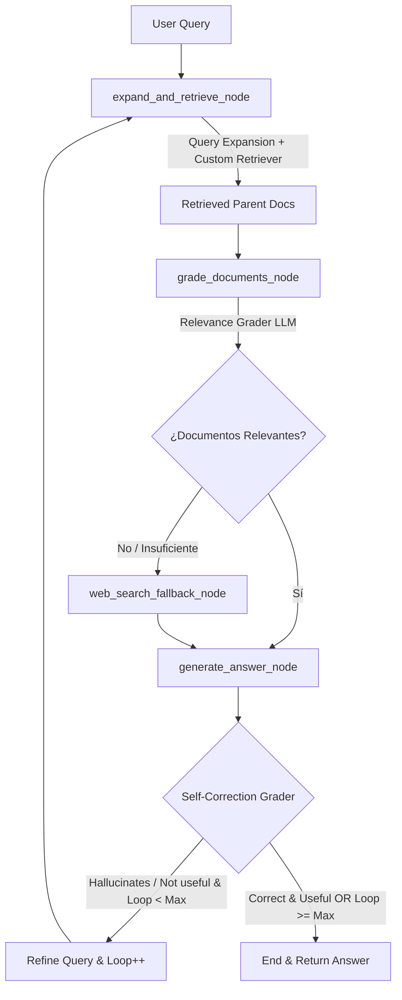

# 🏛️ Arquitectura Enterprise MLOps (RAG Agentivo v2)

Nuestra tubería RAG ha evolucionado de un flujo secuencial a una arquitectura de orquestación agentiva y cíclica controlada por un grafo de estados (LangGraph) para auto-corrección de alucinaciones y fallback dinámico.

## 🌊 Diagrama de Flujo del Grafo de Estados (Self-Corrective RAG)

```mermaid
graph TD
    U[User Query] --> Node1[expand_and_retrieve_node]
    Node1 -->|Query Expansion + Custom Retriever| Chunks[Retrieved Parent Docs]
    Chunks --> Node2[grade_documents_node]
    Node2 -->|Relevance Grader LLM| Router1{¿Documentos Relevantes?}
    
    Router1 -- No / Insuficiente --> NodeWeb[web_search_fallback_node]
    Router1 -- Sí --> Node3[generate_answer_node]
    NodeWeb --> Node3
    
    Node3 --> Router2{Self-Correction Grader}
    Router2 -->|Hallucinates / Not useful & Loop < Max| NodeRefine[Refine Query & Loop++]
    NodeRefine --> Node1
    
    Router2 -->|Correct & Useful OR Loop >= Max| NodeEnd[End & Return Answer]
```

## 🧩 Componentes del Grafo (Nodos y Aristas)

- **Nodos:**
  - `expand_and_retrieve_node`: Genera variantes de la consulta en paralelo y ejecuta búsquedas concurrentes en Qdrant + BM25 local usando el Custom Retriever.
  - `grade_documents_node`: Utiliza un modelo rápido de lenguaje con salida JSON estructurada para evaluar la relevancia binaria (relevante/irrelevante) de cada documento recuperado, filtrando falsos positivos.
  - `generate_answer_node`: Sintetiza la respuesta final basándose únicamente en el contexto de documentos relevantes y el historial conversacional.
  - `web_search_fallback_node`: Nodo de contingencia que realiza una búsqueda externa (ej., DuckDuckGo) si no se encontraron documentos locales válidos.
- **Aristas Condicionales (Routing):**
  - **Routing de Relevancia:** Decide si los documentos del Custom Retriever son suficientes. Si la lista queda vacía tras el filtrado, desvía al flujo de búsqueda externa.
  - **Self-Correction (Control de Alucinaciones):** Evalúa la fidelidad (`groundedness`) y utilidad de la respuesta generada. Si se detecta alucinación o falta de relevancia, incrementa el contador de bucles (límite = 3), refina la consulta técnica y vuelve al nodo inicial.

## 🧩 Estrategia de Retrieval: Patrón Parent-Child
En lugar de cargar pesados documentos enteros o diminutos trozos de texto inconexos al LLM, hemos partido la tubería empleando heurística *Parent / Child*:
- **Los Hijos (Child Chunks):** Son fragmentos de 400 a 600 tokens con fuerte densidad semántica inyectados directo en Qdrant. Debido a su diminuta agudeza focal, la distancia cosenoidal arroja aciertos certeros en la topología vectorial.
- **Los Padres (Parent Documents):** Una vez que un Child Chunk es marcado como "relevante", no le damos el pequeño corte de información al Agente. En cambio, trazamos su UUID para mapear y devolver de nuevo a la tubería **todo el archivo Padre Original íntegro**, proporcionándole a DeepSeek o Llama un contexto infinito y robusto.

## ⚖️ Búsqueda Híbrida Balanceada (50/50 Ensemble)
Nuestro motor implementa un pipeline `EnsembleRetriever` ponderado a `0.5` Vectorial y `0.5` Léxico (`BM25`).
- Permite detectar el *sentido abstracto* de la pregunta (Vectores).
- Evita el *"Zero Match"*, siendo letal contra papers altamente densificados con fórmulas ("Retinex", o acrónimos "SSR").

## 🛡️ Guardrails de Seguridad (0.15 Logit Threshold)
Al final de la recuperación, el Cross Encoder ejecuta una regresión que descarta los falsos positivos. Todo tensor que obtenga menos de `0.15` en confianza es **destruido**. De este modo, evitamos prompts vacíos que degeneran en alucinaciones puras; si no poseemos un contexto verídico recuperado, el bot se cruza de brazos protegiendo la identidad de la App.
