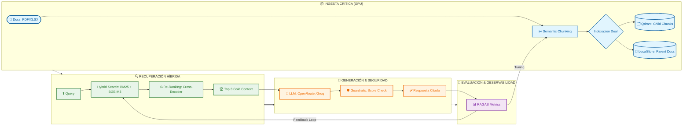

# 🏢 Motor RAG de Grado Industrial con Reranking de sub-segundo


Repositorio de grado de producción que implementa una arquitectura **Retrieval-Augmented Generation (RAG)** asíncrona, enfocándose en la soberanía de los datos (local-first) y el rendimiento determinista escalado sobre aceleradores de hardware NVIDIA. 

## ⚙️ Enterprise Features (Data Engineering & Hardware)

El sistema integra componentes rigurosos para solventar los fallos típicos (alucinaciones, pérdida del contexto y cuellos de botella CPU) de los RAG convencionales:

- **Aceleración Nativa CUDA:** Inferencia optimizada explícitamente para arquitecturas NVIDIA Ampere empleando CUDA 12.4. Esto permitió reducir la latencia del componente de Re-Ranking logrando tiempos consistentes de `< 500ms` en una RTX 3060.
- **Recuperación *"Parent-Child"*: ** Implementación de separación estricta: Búsqueda focalizada vectorial sobre fragmentos agudos (Hijos Semánticos de 600 tokens) para obtener puntajes de precisión de ~0.95, combinada con la inyección del archivo Global (Padres Completos) al payload del LLM, erradicando el problema de la pérdida de contexto.
- **Búsqueda Híbrida Ponderada:** Ensamble matemático (50/50 Ensemble) de motor léxico `BM25` (Sparse) y motor vectorial semántico `BGE-M3` (Dense) previniendo "Zero Matches" en terminología técnica y acrónimos severos.
- **Ingesta Asíncrona (Non-Blocking):** Pipeline encapsulado sobre `FastAPI BackgroundTasks`. Absorbe 289 documentos técnicos persistiendo la evaluación global sin detener el hilo principal ni agotar el Thread Pool de las peticiones HTTP del usuario.

## 📊 Observabilidad y MLOps (Baseline Heurístico)

No se asume el rendimiento; se mide. Operamos auditorías automatizadas contra un **"Golden Dataset"** (batería de pruebas de ingenieros humanos) garantizando que nuestras refactorizaciones no degraden la calidad generativa previniendo cualquier alucinación.

**Línea Base Cuantitativa con Framework `Ragas v0.2+`:**

| Métrica MLOps | Score Evaluado | Significado Operativo |
| :--- | :--- | :--- |
| **Faithfulness** | `0.6061` | Nivel de fidelidad restrictiva de la IA contra el contexto extraído. |
| **Context Precision** | `0.6667` | Exactitud del Reranker midiendo el ratio de ruido (basura léxica o vectorial) del material recuperado. |

## 🌊 Arquitectura de Ingestión y Recuperación



## 🏗️ Estructura del Código Fuente

El diseño modular respeta el patrón de "Separation of Concerns" bajo tipado estricto `PEP 484`:

```text
📦 RAG_Project
 ┣ 📂 scripts/        # Orquestadores ejecutivos (run_ingestion.py, run_evals.py)
 ┣ 📂 src/ 
 ┃ ┣ 📂 agent/        # Lógica conversacional, prompts restrictivos de no-alucinación.
 ┃ ┣ 📂 evals/        # Motor iterativo para Ragas evaluando métricas MLOps.
 ┃ ┣ 📂 ingestion/    # Modelos locales, Semantic Chunking, y parseo Pydantic global.
 ┃ ┣ 📂 retrieval/    # Ensamble avanzado: BM25, Qdrant Client, Cross-Encoders.
 ┃ ┗ 📜 main.py       # ASGI FastAPI Server, Gestión HW (empty_cache via lifespan).
 ┗ 📜 pyproject.toml  # Lock dependencies (uv) apuntando a index pytorch-cu124.
```

## 🗺️ Roadmap de Producto

Hitos de estabilización pendientes enfocados en escalar la IA a nivel Institucional:

1. **Dockerización Nativa:** Despliegue empaquetado multi-stage soportando injecciones de driver NVIDIA Runtime Container Toolkit.
2. **Telemetría de Red Local:** Instrumentación de logs sub-militamétricos separando el tiempo de procesamiento (Embeddings vs Híbrido vs Generación).
3. **Chain-of-Thought (CoT):** Inyecciones de prompts ocultos forzando comprobaciones de razonamiento técnico en modelos locales Open-Source.
