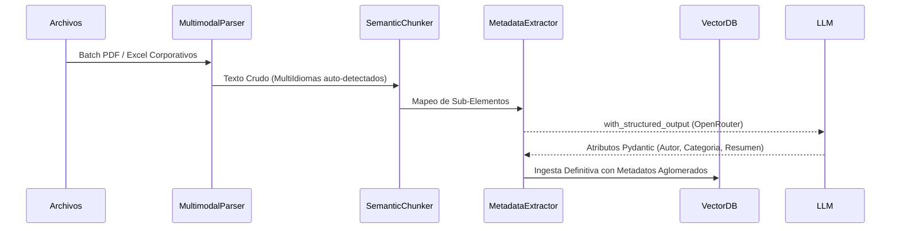

# 📥 Ingestion Pipeline & Metadata

El módulo de Ingesta no solo inserta datos; es una capa de preprocesamiento, limpieza técnica (Data Wrangling), y transformación dimensional. Se destaca el "Auto-Sanado" al contactar LLMs para extraer atributos JSON.

## 1. Semantic Chunking (Fragmentación Semántica Personalizada)

Descartamos el agrupamiento tradicional basado netamente en contadores de palabras y las librerías obsoletas de `langchain-experimental`. En su lugar, implementamos un **`CustomSemanticChunker`** que opera de la siguiente manera:

- **Segmentación de Oraciones:** Divide el texto crudo en oraciones usando expresiones regulares.
- **Generación de Embeddings:** Calcula representaciones vectoriales para cada oración usando el modelo `BGE-M3` local.
- **Cálculo de Distancia Cosenoidal:** Mide la distancia de coseno entre oraciones adyacentes para evaluar la continuidad del flujo semántico.
- **Detección de Puntos de Quiebre (Breakpoints):** Utiliza gradientes numéricos (`numpy.gradient`) o percentiles dinámicos para identificar variaciones bruscas en el significado y segmentar el texto en párrafos semánticamente autónomos.
- **Relaciones Padre-Hijo (Parent Document Paradigm):** El pipeline final de indexación (`ParentDocumentRetriever`) asocia estas secciones a fragmentos hijos menores (`chunk_size=600`, `chunk_overlap=50` en el splitter secundario), los cuales se indexan en Qdrant, mientras que el documento padre enriquecido semánticamente se conserva íntegro en el File Store local.

## 2. Metadata Extraction con Auto-Healing (Pydantic)

Archivos burocráticos implican grandes bloques de basura estática. Invocamos un parsing estructurado con **Pydantic** a través de `Structured Output` de LangChain.

### Estructura de Salida Modelada (Definición Fuerte)
```python
class DocumentMetadata(BaseModel):
    document_type: str = Field(description="Tipo de contrato: SLA, Manual Escolar, Acuerdo legal.")
    authors: List[str] = Field(description="Partes firmantes o autores definidos.")
    summary: str = Field(description="Briefing de no más de 20 palabras.")
```

### Auto-Sanado (Auto-Healing mechanism)
El framework atrapa automáticamente deserciones JSON generadas por el LLM mediante la mecánica de "Re-try with correction".
1. Si el LLM retorna texto truncado (e.g. cortes por fallos en la estructura de comillas).
2. Se levanta un interceptor `ValidationError` de Pydantic.
3. Se invuelve el mismo error como Prompt Correctivo sumado a la string cruda previa y se lanza la corrección de vuelta a la red neuronal hasta parsear un AST limpio.

### Inserción Local (LocalStorage / Qdrant)
Los metadatos purificados se adhieren al Parent Document (al File Store `data/kv_store/`) permitiendo a futuro aplicar "Filtros Metadata" (ej. "Trae todo lo coincidente al tema X, *filtrado exclusivamente al contratista Y*").

## 3. Flujo Lógico de Extracción


```mermaid
sequenceDiagram
    participant Archivos
    participant MultimodalParser
    participant SemanticChunker
    participant MetadataExtractor
    participant VectorDB
    
    Archivos->>MultimodalParser: Batch PDF / Excel Corporativos
    MultimodalParser->>SemanticChunker: Texto Crudo (MultiIdiomas auto-detectados)
    SemanticChunker->>MetadataExtractor: Mapeo de Sub-Elementos
    MetadataExtractor-->>LLM: with_structured_output (OpenRouter)
    LLM-->>MetadataExtractor: Atributos Pydantic (Autor, Categoria, Resumen)
    MetadataExtractor->>VectorDB: Ingesta Definitiva con Metadatos Aglomerados
```

### Hitos MLOps Claves adicionales:
- **Robustez Multilingüe con Tesseract:** Al procesar mediante dependencias `unstructured`, la partición respeta el estándar `languages=["spa", "eng"]` evitando fallos nativos con contratos en Spanglish, o donde coexiste fuertemente literatura técnica en inglés.
