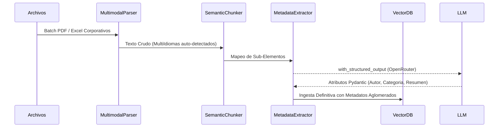

# Pipeline de Ingesta y Limpieza de Datos

El módulo albergado bajo `src/ingestion` está estrictamente diseñado para triturar ficheros administrativos desestructurados e irradiarlos hacia un repositorio utilizable.

## Flujo Lógico de Extracción

### Hitos MLOps Claves:
- **Auto-Healing Nativo:** La ingesta interactúa con LLMs gratuitos que inherentemente experimentan inestabilidad (`google/gemini-2.0-flash-lite...`). Validamos mediante `Pydantic` su inferencia y lanzamos reintentos automatizados al top level capturando descarrilamientos sin abortar la ejecución macro.
- **Robustez Multilingüe Tesseract:** Integrando librerías `unstructured`, la partición respeta el estándar `languages=["spa", "eng"]` evitando roturas de diccionarios que la dependencia Tesseract emitiría si inyectamos inglés y castellano silvestre en contratos complejos.
